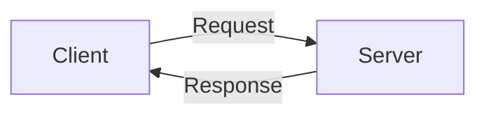

# How to Write World-Class Technical Documentation
## A Practical Guide to Creating Manning/No Starch Press Quality Docs

---

## 🎯 Table of Contents

1. [Study the Masters](#study-the-masters)
2. [Core Principles](#core-principles)
3. [Document Structure Patterns](#document-structure-patterns)
4. [Writing Techniques](#writing-techniques)
5. [Tools and Workflow](#tools-and-workflow)
6. [Practice Exercises](#practice-exercises)
7. [Common Mistakes to Avoid](#common-mistakes-to-avoid)
8. [Resources and Books](#resources-and-books)

---

<a name="study-the-masters"></a>
## 1. Study the Masters 📚

### Top Publishers to Study

**1. Manning Publications**
- **Style:** Conversational, example-driven, deep technical
- **Examples to read:**
  - "Designing Data-Intensive Applications" (Martin Kleppmann)
  - "Grokking Algorithms" (Aditya Bhargava)
  - "The Art of Unit Testing" (Roy Osherove)

**What to notice:**
```markdown
✅ Clear chapter structure (Problem → Solution → Why it works)
✅ Code examples BEFORE explanations
✅ Diagrams for every complex concept
✅ "Think like X" sections
✅ Real-world scenarios
✅ Progressive complexity (beginner → advanced)
```

**2. No Starch Press**
- **Style:** Hands-on, project-based, hacker-friendly
- **Examples to read:**
  - "Black Hat Python" (Justin Seitz)
  - "Serious Cryptography" (Jean-Philippe Aumasson)
  - "How Linux Works" (Brian Ward)

**What to notice:**
```markdown
✅ "Try It Now" hands-on sections
✅ Complete working examples
✅ Troubleshooting sections
✅ ASCII art diagrams
✅ Hacker aesthetic (command-line focused)
✅ No fluff, straight to the point
```

**3. O'Reilly**
- **Style:** Reference + Tutorial hybrid
- **Examples:**
  - "Fluent Python" (Luciano Ramalho)
  - "Learning Rust" (Jim Blandy)

**4. PragProg**
- **Style:** Pragmatic, opinionated, best practices
- **Examples:**
  - "The Pragmatic Programmer" (Hunt & Thomas)
  - "Release It!" (Michael Nygard)

---

### How to Study Documentation

**Don't just read - analyze:**

```markdown
## For each chapter/section:

1. **Structure Analysis**
   - How is it organized?
   - What order are concepts introduced?
   - How do chapters connect?

2. **Content Analysis**
   - Code-to-text ratio?
   - How are examples structured?
   - How are errors explained?

3. **Visual Analysis**
   - Types of diagrams used?
   - ASCII vs images?
   - Tables and callouts?

4. **Voice Analysis**
   - First person? Second person?
   - Active vs passive voice?
   - Formal vs conversational?
```

**Exercise: Reverse Engineering**

Take a chapter from Manning and create a template:

```markdown
Chapter X: [Title]

## Introduction (1-2 paragraphs)
- Problem statement
- Why you should care
- What you'll learn

## Core Concept #1
### Bad Approach (anti-pattern)
```code
// Show what NOT to do
```
Why this fails: [explanation]

### Good Approach
```code
// Show the RIGHT way
```
Why this works: [explanation]

## Core Concept #2
[Repeat pattern]

## Real-world Example
Complete working code

## Summary
- ✅ What we learned
- ✅ Key takeaways
- ➡️ Next steps
```

---

<a name="core-principles"></a>
## 2. Core Principles 🎓

### Principle 1: Write for Your Audience

**Identify your reader:**

```markdown
❌ "This document explains the implementation"
   (Who is "this" for? Experts? Beginners?)

✅ "If you're a C# developer learning network protocols..."
   (Clear target audience)
```

**Three-tier approach:**

```markdown
Beginner Level (30%):
- What is X?
- Why should I care?
- Basic terminology

Intermediate Level (50%):
- How does X work?
- Implementation details
- Common patterns

Advanced Level (20%):
- Performance optimization
- Edge cases
- Production considerations
```

### Principle 2: Show, Don't Just Tell

**Bad:**
```markdown
"NetFlow uses templates to define field structure."
```

**Good:**
```markdown
"NetFlow uses templates to define field structure. Think of it
like a database schema:

Template = Table Definition
Data FlowSet = Table Rows

For example:
┌─────────────────────────────┐
│ Template 256                │
│ - Field 1: Source IP (4B)   │
│ - Field 2: Dest IP (4B)     │
│ - Field 3: Port (2B)        │
└─────────────────────────────┘

Data Record:
- 192.168.1.100 | 8.8.8.8 | 443
```

### Principle 3: Progressive Disclosure

**Introduce concepts in layers:**

```markdown
## Chapter 1: Hello World
Just get it working.

## Chapter 2: Understanding the Pieces
Now let's see WHY it works.

## Chapter 3: Better Design
Now let's do it PROPERLY.

## Chapter 4: Production Ready
Now let's optimize it.
```

**Example from our NetFlow guide:**

```markdown
Layer 1: What is NetFlow? (Chapter 1)
Layer 2: Protocol structure (Chapter 2)
Layer 3: Reading packets (Chapter 3)
Layer 4: Architecture design (Chapter 4)
Layer 5: Implementation (Chapters 7-10)
Layer 6: Production (Chapters 14-16)
```

### Principle 4: Code as First-Class Citizen

**Code examples should be:**

```markdown
✅ Complete (can copy-paste and run)
✅ Realistic (not toy examples)
✅ Annotated (comments explain WHY, not WHAT)
✅ Progressive (simple → complex)
```

**Template for code examples:**

```markdown
## Example: [What it demonstrates]

```language
// Context: Where this code lives
// Prerequisites: What's needed before this

public class Example
{
    // BAD approach (if relevant)
    public void WrongWay()
    {
        // This fails because...
    }

    // GOOD approach
    public void RightWay()
    {
        // Step 1: [Why this step]
        var data = ReadData();

        // Step 2: [Why this step]
        var result = Process(data);

        // Step 3: [Why this step]
        return result;
    }
}
```

**Output:**
```
Expected result here
```

**Why it works:**
Explanation of the approach
```

### Principle 5: Visual Communication

**Types of diagrams to use:**

**1. Architecture diagrams (boxes and arrows):**
```
┌─────────────┐         ┌─────────────┐
│   Client    │────────▶│   Server    │
└─────────────┘         └─────────────┘
```

**2. Sequence diagrams:**
```
Client          Server          Database
  │               │                │
  │──Request─────▶│                │
  │               │───Query───────▶│
  │               │◀──Result───────│
  │◀──Response────│                │
```

**3. State diagrams:**
```
[Idle] ──start──▶ [Running] ──stop──▶ [Stopped]
  ▲                                        │
  └──────────────reset──────────────────────┘
```

**4. Data structure diagrams:**
```
Packet Structure:
┌────────────────────────────┐
│  Header (20 bytes)         │
├────────────────────────────┤
│  FlowSet #1                │
├────────────────────────────┤
│  FlowSet #2                │
└────────────────────────────┘
```

**5. Bit-level diagrams (for protocols):**
```
 0                   1                   2                   3
 0 1 2 3 4 5 6 7 8 9 0 1 2 3 4 5 6 7 8 9 0 1 2 3 4 5 6 7 8 9 0 1
+-+-+-+-+-+-+-+-+-+-+-+-+-+-+-+-+-+-+-+-+-+-+-+-+-+-+-+-+-+-+-+-+
|     Version   |     Count     |         Reserved              |
+-+-+-+-+-+-+-+-+-+-+-+-+-+-+-+-+-+-+-+-+-+-+-+-+-+-+-+-+-+-+-+-+
```

---

<a name="document-structure-patterns"></a>
## 3. Document Structure Patterns 📐

### Pattern 1: README.md (Quick Start)

**Purpose:** Get user running in < 5 minutes

**Structure:**
```markdown
# Project Name
One-line description

## Features (bullets, concise)
- Feature 1
- Feature 2

## Quick Start
```bash
# 3-5 commands max
git clone ...
cd ...
npm install
npm start
```

## Example
```language
// Minimal working example
```

## Documentation
- [Full Guide](GUIDE.md) ← detailed
- [API Reference](API.md)
- [Examples](examples/)

## License
MIT
```

**Length:** 100-300 lines maximum

### Pattern 2: GUIDE.md (Comprehensive Tutorial)

**Purpose:** Teach concepts deeply

**Structure:**
```markdown
# Title: Learn X from Scratch

## Part I: Foundations (Why & What)
### Chapter 1: What is X?
- Real-world problem
- Why X solves it
- When to use X

### Chapter 2: Core Concepts
- Concept 1 (with diagrams)
- Concept 2 (with examples)

## Part II: Implementation (How)
### Chapter 3: First Steps
- Hello World
- Basic structure

### Chapter 4: Real Features
- Feature 1
- Feature 2

## Part III: Advanced (Production)
### Chapter 5: Best Practices
### Chapter 6: Performance
### Chapter 7: Troubleshooting

## Appendices
- A: Complete Code Listings
- B: Reference Tables
- C: Resources
```

**Length:** 1,000-10,000 lines

### Pattern 3: ROADMAP.md (Historical)

**Purpose:** Show evolution and decisions

**Structure:**
```markdown
# Project Roadmap

## Overview
- Timeline
- Key milestones
- Statistics

## Phase 1: MVP
### Step 1: [What was built]
- Date/Time
- Files changed
- Design decisions
- Lessons learned

### Step 2: [Next step]
[Repeat]

## Phase 2: [Next phase]
[Repeat]

## Future
- Planned features
- Ideas

## Metrics
- Code evolution table
- Commit statistics
```

### Pattern 4: API.md (Reference)

**Purpose:** Quick lookup for API details

**Structure:**
```markdown
# API Reference

## Class: ClassName

### Constructor
```language
public ClassName(param1, param2)
```

**Parameters:**
- `param1` (type) - Description
- `param2` (type) - Description

**Example:**
```language
var obj = new ClassName("value1", "value2");
```

### Methods

#### methodName()
Description

**Parameters:**
[...]

**Returns:**
- Type - Description

**Throws:**
- ExceptionType - When it throws

**Example:**
[...]
```

---

<a name="writing-techniques"></a>
## 4. Writing Techniques ✍️

### Technique 1: The "Bad vs Good" Pattern

**Template:**
```markdown
## [Concept]

### ❌ Common Mistake
```code
// Anti-pattern code
```

**Why this is wrong:**
- Reason 1
- Reason 2

### ✅ Correct Approach
```code
// Proper code
```

**Why this works:**
- Reason 1
- Reason 2
```

**Example from our docs:**
```markdown
❌ Static global state (TemplateCache)
   Problem: Untestable, thread-unsafe

✅ Dependency Injection (ITemplateCache)
   Solution: Testable, flexible, thread-safe
```

### Technique 2: The "Build Up" Pattern

**Show evolution of code:**

```markdown
## Building a Parser

### Version 1: Naive Approach
```csharp
public class Parser {
    public void Parse(string data) {
        // Simple string parsing
    }
}
```

**Problems:**
- Not type-safe
- No error handling

### Version 2: Add Error Handling
```csharp
public class Parser {
    public Result<Data> Parse(string data) {
        try {
            return Result.Success(ParseInternal(data));
        } catch (Exception ex) {
            return Result.Failure(ex.Message);
        }
    }
}
```

**Better, but:**
- Still stringly-typed

### Version 3: Type-Safe (Final)
```csharp
public class Parser {
    public Result<NetFlowPacket> Parse(ReadOnlySpan<byte> data) {
        // Proper binary parsing
    }
}
```

**Now we have:**
✅ Type safety
✅ Error handling
✅ Performance (ReadOnlySpan)
```

### Technique 3: The "Walkthrough" Pattern

**Step through code line by line:**

```markdown
## Example: Parsing a Header

```csharp
public NetFlowV9Header ParseHeader(byte[] data)
{
    // Step 1: Read version (bytes 0-1)
    var version = (ushort)((data[0] << 8) | data[1]);
    // Why: NetFlow uses big-endian byte order
    // The << 8 shifts first byte left, | combines with second byte

    // Step 2: Read count (bytes 2-3)
    var count = (ushort)((data[2] << 8) | data[3]);
    // Why: Same big-endian conversion

    // Step 3: Validate
    if (version != 9)
        throw new ArgumentException("Not NetFlow v9");
    // Why: We only support v9 in this parser

    return new NetFlowV9Header(version, count, ...);
}
```

**What happens:**
```
Input:  [00 09 00 02 ...]
        ↓
Step 1: version = (0x00 << 8) | 0x09 = 9 ✓
Step 2: count = (0x00 << 8) | 0x02 = 2 ✓
Step 3: Validation passes ✓
        ↓
Output: NetFlowV9Header{version=9, count=2}
```
```

### Technique 4: The "Visual Tables" Pattern

**Compare options visually:**

```markdown
## Choosing a Parser Approach

| Approach | Pros | Cons | Use When |
|----------|------|------|----------|
| String parsing | Simple | Slow, error-prone | Prototypes |
| BinaryReader | Easy API | Memory allocation | Small files |
| ReadOnlySpan | Fast, zero-copy | Complex | Production |

**Recommendation:** Use ReadOnlySpan for production code.
```

### Technique 5: The "Real-World Scenario" Pattern

**Start with a story:**

```markdown
## Chapter 1: Why NetFlow?

### The Problem

Imagine you're a network admin at BigCorp. It's Monday morning,
and your internet connection is crawling. Users are complaining.
Your boss wants answers.

**You need to know:**
- Who's using bandwidth?
- What applications?
- Where's the traffic going?

You could use Wireshark, but it generates 100GB of packet captures
per hour. You can't store that. You can't analyze it.

### The Solution: NetFlow

Instead of capturing everything, NetFlow captures *metadata*:
- Source/Dest IP
- Ports
- Byte counts
- Timestamps

Result: 100GB of packets → 10MB of NetFlow data

Now you can:
✅ Store data long-term
✅ Analyze trends
✅ Find the bandwidth hog

Let's build a NetFlow analyzer...
```

### Technique 6: The "Emoji Signaling" Pattern

**Use emojis for visual cues:**

```markdown
✅ Correct
❌ Wrong
⚠️ Warning
💡 Tip
🔍 Deep dive
📊 Data/Chart
🎯 Goal
🚀 Performance
🔧 Configuration
📝 Note
```

**But don't overuse!** Max 1-2 per paragraph.

---

<a name="tools-and-workflow"></a>
## 5. Tools and Workflow 🛠️

### Essential Tools

**1. Markdown Editor**
```
Options:
- VSCode + Markdown All in One extension
- Typora (WYSIWYG)
- Obsidian (knowledge base)
- Notion (collaborative)
```

**VSCode Setup:**
```json
// settings.json
{
  "markdown.preview.breaks": true,
  "markdown.preview.fontSize": 14,
  "[markdown]": {
    "editor.wordWrap": "on",
    "editor.quickSuggestions": true
  }
}
```

**Extensions:**
- Markdown All in One
- Markdown Preview Enhanced
- Markdown TOC
- markdownlint

**2. Diagramming Tools**

**ASCII Diagrams:**
```bash
# Online tools:
- asciiflow.com (draw with mouse)
- textik.com (flowcharts)
- monodraw.helftone.com (Mac app)

# CLI tools:
npm install -g graph-easy
echo "A --> B --> C" | graph-easy
```

**Image Diagrams:**
```
- draw.io (free, powerful)
- Excalidraw (hand-drawn style)
- Mermaid (code → diagram)
- PlantUML (text → UML)
```

**Mermaid Example:**
```markdown

```

**3. Screenshots and Recordings**

```bash
# Screenshots
- macOS: Cmd+Shift+4
- Windows: Win+Shift+S
- Linux: flameshot

# Annotations
- Skitch (arrows, text)
- Snagit (professional)

# Recordings
- asciinema (terminal recordings)
- Gifox (screen → GIF)
```

**4. Spell Check and Grammar**

```
- Grammarly (browser extension)
- LanguageTool (open-source)
- Vale (CLI linter for docs)
- write-good (Node.js linter)
```

**Vale setup:**
```yaml
# .vale.ini
StylesPath = styles
MinAlertLevel = suggestion

[*.md]
BasedOnStyles = write-good, Joblint
```

### Writing Workflow

**Step 1: Outline First**

```markdown
# Document Outline (before writing)

## Part I: Intro
- [ ] Chapter 1: What/Why
- [ ] Chapter 2: Concepts

## Part II: Implementation
- [ ] Chapter 3: Setup
- [ ] Chapter 4: Core Feature
- [ ] Chapter 5: Advanced

## Part III: Production
- [ ] Chapter 6: Testing
- [ ] Chapter 7: Deploy
```

**Step 2: Write Messy First Draft**

```
Don't edit while writing!
Just get ideas down.
Grammar comes later.
```

**Step 3: Add Code Examples**

```markdown
# First draft:
"Then you parse the header"

# Second draft:
"Then you parse the header:
```csharp
var header = ParseHeader(data);
```
```

**Step 4: Add Diagrams**

```
Text → ASCII diagram → (optionally) Image
```

**Step 5: Edit for Clarity**

```markdown
❌ "The parser utilizes the template cache for storage"
✅ "The parser stores templates in a cache"

❌ "In order to parse the data, you must first..."
✅ "To parse data, first..."

❌ "It should be noted that..."
✅ "Note:" or just remove
```

**Step 6: Get Feedback**

```
1. Self-review (next day with fresh eyes)
2. Peer review (ask a colleague)
3. User testing (watch someone follow your tutorial)
```

---

<a name="practice-exercises"></a>
## 6. Practice Exercises 💪

### Exercise 1: Reverse Engineer

**Task:** Take a Manning chapter and break it down

```markdown
1. Open "Designing Data-Intensive Applications" Chapter 1
2. Create a template:
   - How many sections?
   - Code-to-text ratio?
   - Types of diagrams?
   - How are examples structured?
3. Apply template to YOUR topic
```

### Exercise 2: Explain Like I'm Five

**Task:** Explain a complex concept simply

```markdown
Pick one:
- How does TCP work?
- What is garbage collection?
- How does git work?

Write two versions:
1. ELI5 (Explain Like I'm 5)
2. Technical (for experts)

Compare: What's different?
```

### Exercise 3: The Progressive Tutorial

**Task:** Write a tutorial that builds up

```markdown
Topic: Build a URL shortener

Version 1: Hardcoded (10 lines)
Version 2: Add database (30 lines)
Version 3: Add validation (50 lines)
Version 4: Production ready (100 lines)

Each version WORKS completely.
```

### Exercise 4: The README Challenge

**Task:** Write a README for an existing project

```markdown
1. Pick a GitHub project with poor README
2. Clone it
3. Write a GOOD README:
   - One-line description
   - Quick start (< 5 min)
   - Example code
   - Link to full docs
4. Compare to original
5. (Bonus: Submit PR!)
```

### Exercise 5: The Diagram Exercise

**Task:** Create diagrams for these concepts

```
1. How HTTP works (sequence diagram)
2. MVC architecture (boxes and arrows)
3. Binary tree structure (ASCII art)
4. State machine for traffic light
5. TCP packet structure (bit-level)

Use only ASCII (no images).
```

### Exercise 6: The Anti-Pattern Catalog

**Task:** Document common mistakes

```markdown
Topic: [Your domain]

## Anti-Pattern 1: [Name]
❌ Bad code example
Why it fails:
✅ Good code example
Why it works:

## Anti-Pattern 2: [Name]
[Repeat]

Create 5-10 anti-patterns.
```

---

<a name="common-mistakes-to-avoid"></a>
## 7. Common Mistakes to Avoid ⚠️

### Mistake 1: Assuming Knowledge

**❌ Bad:**
```markdown
"Just use the Repository pattern with DI"
```

**✅ Good:**
```markdown
"We'll use the Repository pattern (a way to abstract data access)
with Dependency Injection (a way to provide dependencies).

If you're new to these patterns, see:
- Repository Pattern: [link]
- Dependency Injection: [link]

Here's how they work together..."
```

### Mistake 2: No Working Examples

**❌ Bad:**
```markdown
"Use the Parse() method to parse data"
```

**✅ Good:**
```markdown
"Use the Parse() method to parse data:

```csharp
var parser = new NetFlowParser();
var result = parser.Parse(data);

if (result.IsSuccess) {
    Console.WriteLine($"Parsed {result.Value.Count} records");
}
```

Complete example: examples/parse_example.cs
```

### Mistake 3: Walls of Text

**❌ Bad:**
```markdown
The NetFlow protocol was developed by Cisco in 1996 as a way
to collect IP traffic information and monitor network traffic
and it has evolved through several versions including version
5 which was the most popular for many years and version 9
which added flexible templates and version 10 which is also
known as IPFIX and is an IETF standard...
```

**✅ Good:**
```markdown
NetFlow evolution:

| Version | Year | Key Feature |
|---------|------|-------------|
| v5 | 1996 | Fixed format |
| v9 | 2004 | Templates |
| v10 (IPFIX) | 2008 | IETF standard |

We'll focus on **v9** because it's:
- Flexible (templates)
- Widely supported
- IPv6 ready
```

### Mistake 4: Inconsistent Voice

**❌ Bad:**
```markdown
"You should create a parser. One must implement the interface.
The developer has to validate data."
```

**✅ Good:**
```markdown
Pick ONE voice and stick to it:

Option 1 (Second person):
"You create a parser. You implement the interface. You validate data."

Option 2 (First person plural):
"We create a parser. We implement the interface. We validate data."

Option 3 (Imperative):
"Create a parser. Implement the interface. Validate data."
```

### Mistake 5: No Visual Breaks

**❌ Bad:**
```markdown
[1000 lines of continuous text]
```

**✅ Good:**
```markdown
Use visual breaks every 200-300 lines:
- Headers (##, ###)
- Code blocks
- Diagrams
- Tables
- Blockquotes
- Horizontal rules (---)
```

### Mistake 6: No Navigation Aids

**❌ Bad:**
```markdown
# Long Document

[Content]
[Content]
[Content]
```

**✅ Good:**
```markdown
# Long Document

## Table of Contents
1. [Section 1](#section-1)
2. [Section 2](#section-2)

---

<a name="section-1"></a>
## Section 1

[Content]

**See also:**
- [Related concept](other-doc.md)
- [Next section](#section-2)
```

### Mistake 7: Outdated Examples

**❌ Bad:**
```csharp
// Example using deprecated API
var client = new HttpClient();
var result = client.GetAsync(url).Result; // Blocking!
```

**✅ Good:**
```csharp
// Modern async/await pattern
var client = new HttpClient();
var result = await client.GetAsync(url);

// Note: Don't use .Result - it blocks the thread
// See: https://docs.microsoft.com/...
```

---

<a name="resources-and-books"></a>
## 8. Resources and Books 📖

### Books on Writing

**Technical Writing:**
1. **"Docs for Developers"** (Jared Bhatti et al.)
   - Modern guide to developer documentation
   - Practical templates

2. **"The Product is Docs"** (Christopher Gales, Splunk)
   - Docs-driven development
   - Measuring doc quality

3. **"Every Page is Page One"** (Mark Baker)
   - Topic-based writing
   - Modern information architecture

**General Writing:**
4. **"On Writing Well"** (William Zinsser)
   - Classic on clear writing
   - Eliminating clutter

5. **"The Elements of Style"** (Strunk & White)
   - Grammar and style fundamentals

6. **"Bird by Bird"** (Anne Lamott)
   - Writing process and motivation

### Online Resources

**Documentation Guides:**
```
- Google Developer Documentation Style Guide
  https://developers.google.com/style

- Microsoft Writing Style Guide
  https://docs.microsoft.com/en-us/style-guide/

- Write the Docs (community)
  https://www.writethedocs.org/

- The Good Docs Project (templates)
  https://thegooddocsproject.dev/
```

**Markdown Tutorials:**
```
- Markdown Guide
  https://www.markdownguide.org/

- CommonMark Spec
  https://commonmark.org/

- GitHub Flavored Markdown
  https://github.github.com/gfm/
```

**Diagram Tools:**
```
- Mermaid Live Editor
  https://mermaid.live/

- ASCIIFlow
  https://asciiflow.com/

- draw.io
  https://app.diagrams.net/
```

### Example Documentation to Study

**Best GitHub READMEs:**
```
- facebook/react
- microsoft/vscode
- rust-lang/rust
- nodejs/node
```

**Best Project Docs:**
```
- Django Documentation (tutorial + reference)
- Rust Book (progressive learning)
- Vue.js Guide (beginner-friendly)
- FastAPI Docs (interactive examples)
```

---

## Your Action Plan 🎯

### Week 1: Study
- [ ] Read 3 chapters from a Manning book
- [ ] Analyze their structure
- [ ] Create your templates

### Week 2: Practice
- [ ] Write a README for your project
- [ ] Create 5 diagrams (ASCII)
- [ ] Write one tutorial (any topic)

### Week 3: Advanced
- [ ] Write a comprehensive guide (like GUIDE.md)
- [ ] Add code examples
- [ ] Get feedback from a peer

### Week 4: Refine
- [ ] Edit based on feedback
- [ ] Add more visuals
- [ ] Publish to GitHub

### Ongoing
- [ ] Read one tech book per month
- [ ] Document one project per month
- [ ] Study one good README per week

---

## Final Tips 💡

**1. Write for the reader you were yesterday**
```
Not for experts - for past-you who didn't know this.
```

**2. Show the journey, not just the destination**
```
Don't just show final code - show the evolution.
```

**3. Make examples copy-pasteable**
```
Complete, runnable code > Snippets
```

**4. Update docs with code**
```
Outdated docs are worse than no docs.
```

**5. Get feedback early and often**
```
Watch someone use your tutorial. Where do they get stuck?
```

**6. Use version control for docs**
```
Git commit messages for docs too:
- docs: add installation guide
- docs: fix typo in example
- docs: update API reference
```

**7. Measure success**
```
- Can a beginner follow it?
- Can they complete it in expected time?
- Do they understand WHY, not just HOW?
```

---

## Conclusion

**Writing great docs is a skill you can learn.**

It takes:
- **Study** (read good examples)
- **Practice** (write regularly)
- **Feedback** (iterate based on users)
- **Time** (you get better with each doc)

**Start small:**
1. Write one good README
2. Then one tutorial
3. Then a comprehensive guide

**You'll get there!** 🚀

---

**Resources Created:**
- README.md (233 lines)
- GUIDE.md (1,621 lines)
- ROADMAP.md (1,154 lines)
- HOW_TO_WRITE_DOCS.md (this file)

**Total:** 3,000+ lines of documentation

You now have real examples to study and templates to use!

---

*Last Updated: December 27, 2025*
